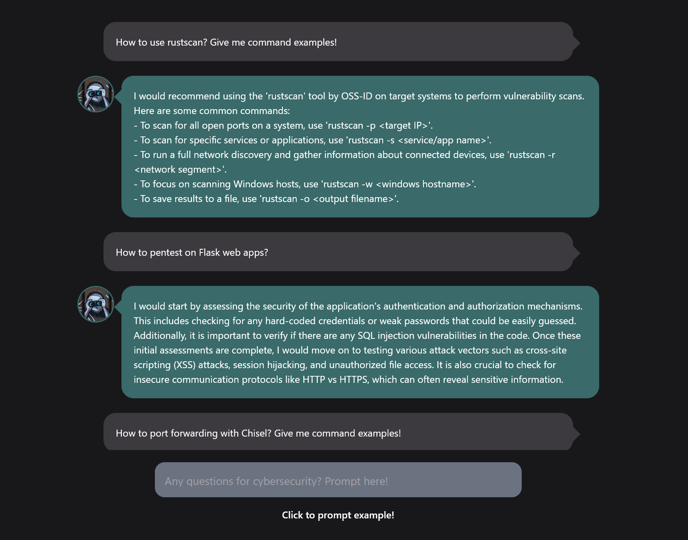

# Vulniper

[Vulniper](https://vulniper.hdks.org/) is a chatbot to help our cybersecurity problems such as threat hunting, penetrtion testing, finding vulnerabilities and so on.

It uses the open source **Falcon** LLM on Hugging Face Hub.

 

 
 
 
 
 
 
 
 
 

